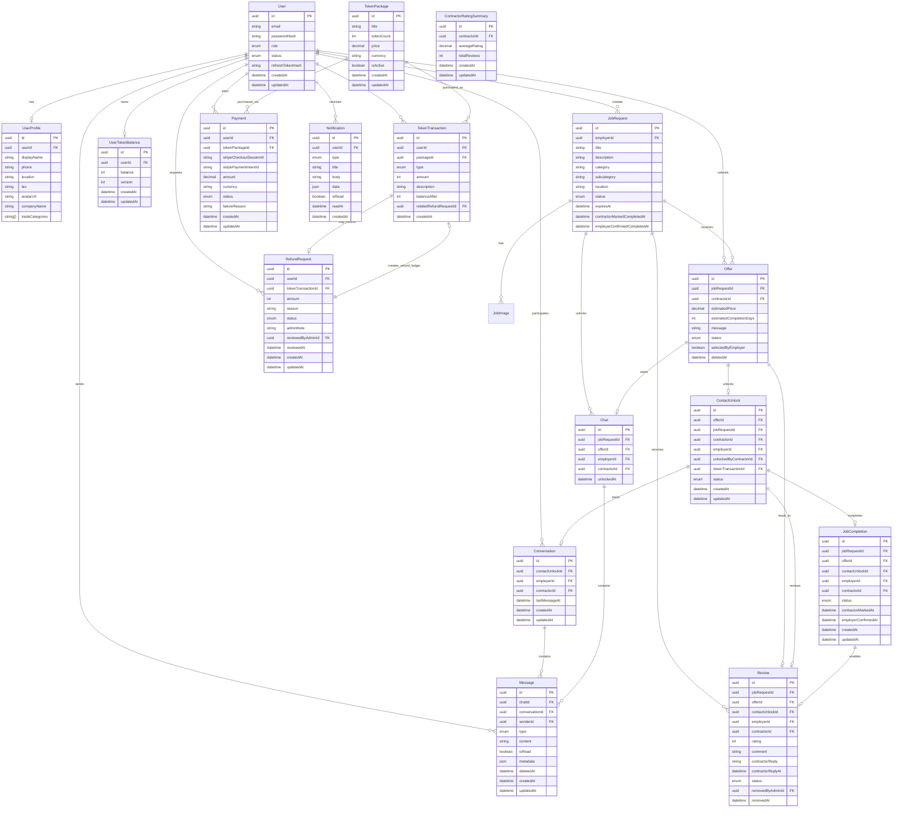

# Database Schema

The database is relational and implemented with Prisma over PostgreSQL.

## Entity Relationship Diagram

## Milestone 1 Tables Used

- `User`
- `UserProfile`
- `JobRequest`
- `JobImage`

## Milestone 2 Tables Used

- `Offer`

Milestone 2 also adds a unique `contractorId + jobRequestId` offer constraint, `selectedByEmployer`, and `deletedAt` for offer withdrawal.

## Milestone 3 Tables Used

- `TokenPackage`
- `UserTokenBalance`
- `TokenTransaction`
- `RefundRequest`

Milestone 3 keeps wallet changes ledgered through `TokenTransaction`. Purchases add positive token amounts, approved refunds add negative `REFUND` transactions, and balances are guarded so they never go below zero.

## Milestone 4 Tables Used

- `ContactUnlock`
- `TokenTransaction`
- `UserTokenBalance`

Milestone 4 adds `ContactUnlock.status`, `unlockedByContractorId`, optional `tokenTransactionId` for pending requests, and `updatedAt`. Unlocks are stored as `SPEND` transactions and contact rows are unique by `offerId`.

## Milestone 5 Tables Used

- `Conversation`
- `Message`
- `Notification`
- `ContactUnlock`

Milestone 5 adds one `Conversation` per unlocked contact relationship through a unique `contactUnlockId`. Messages are text-only for MVP, ordered by `createdAt`, and soft-delete ready through `deletedAt`. Notifications are stored in the database with `isRead`, `readAt`, and JSON metadata so push delivery can be added later without changing the product workflow.

Important indexes:

- `Conversation.contactUnlockId` unique
- `Conversation.employerId + lastMessageAt`
- `Conversation.contractorId + lastMessageAt`
- `Message.conversationId + createdAt`
- `Message.senderId`
- `Message.isRead + createdAt`
- `Notification.userId + isRead + createdAt`

## Milestone 6 Tables Used

- `JobCompletion`
- `Review`
- `ContractorRatingSummary`
- `Notification`

Milestone 6 adds a separate completion workflow keyed by `contactUnlockId`. Reviews are also keyed by contact relationship and support one contractor reply plus admin soft removal. `ContractorRatingSummary` stores active-review aggregates only; removed reviews remain stored but are excluded from `averageRating` and `totalReviews`.

Important indexes:

- `JobCompletion.contactUnlockId` unique
- `JobCompletion.offerId` unique
- `JobCompletion.employerId + status`
- `JobCompletion.contractorId + status`
- `Review.contactUnlockId` unique
- `Review.contractorId + status + removedAt`
- `Review.employerId`

## Milestone 8 Tables Used

- `Payment`
- `TokenPackage`
- `UserTokenBalance`
- `TokenTransaction`

Milestone 8 adds `Payment` rows for Stripe Checkout test-mode purchases. A payment starts as `PENDING`; only a valid Stripe webhook can mark it `PAID`, create a `PURCHASE` token transaction, and increase wallet balance. Failed payment intent webhooks mark payments `FAILED` and do not change token balances.

Important indexes:

- `Payment.stripeCheckoutSessionId` unique
- `Payment.stripePaymentIntentId` unique
- `Payment.userId + createdAt`
- `Payment.status + createdAt`
